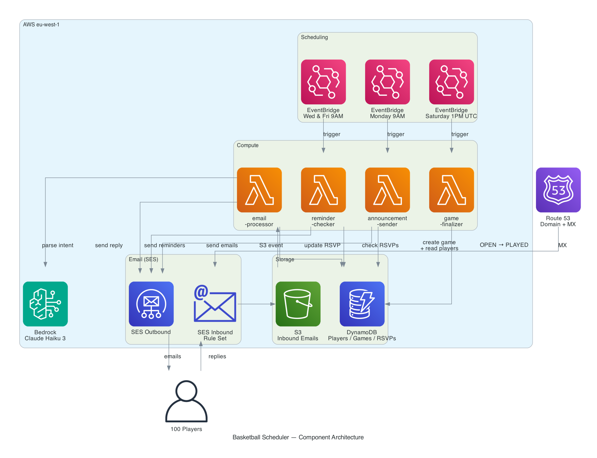
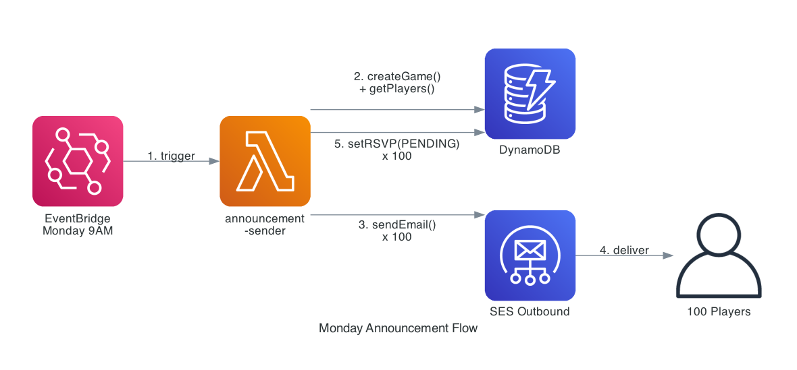
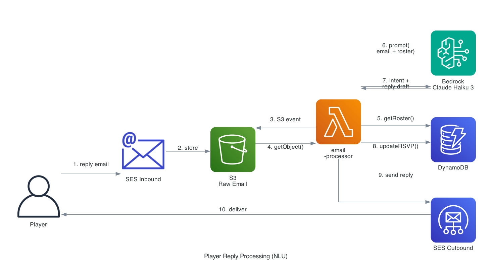
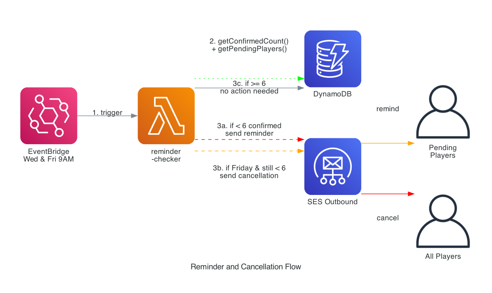
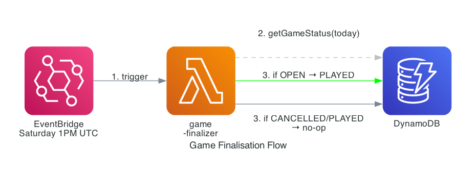
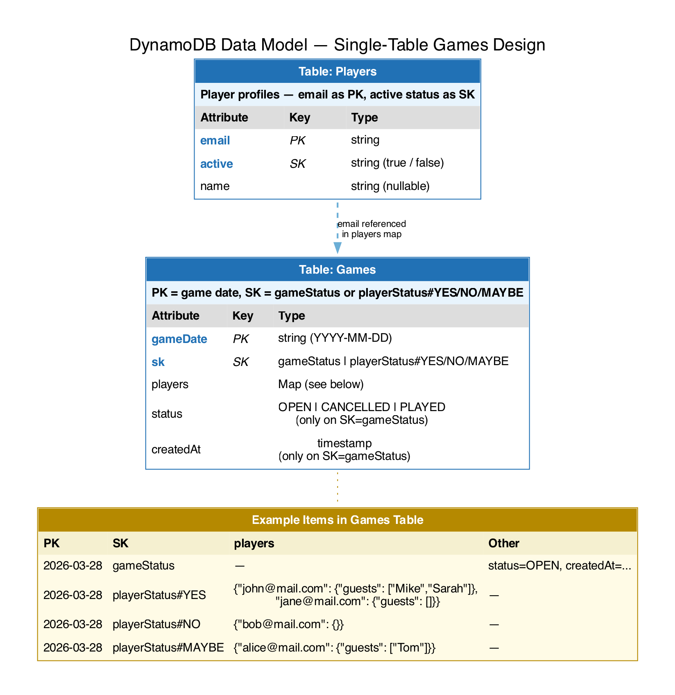

# Basketball Game Scheduler — Architecture (Approach A)

All processing is handled by Lambda functions triggered by EventBridge (scheduled) or S3 events (inbound emails).
Natural language understanding is provided by AWS Bedrock (Claude Haiku 3) in eu-west-1 (Ireland).

**Estimated cost: ~$1.40–1.80/month**

---

## 1. Component Architecture



### How it fits together

| Component | Service | Purpose |
|---|---|---|
| **Scheduling** | EventBridge | Three cron rules: Monday 9AM (announcements), Wed + Fri 9AM (reminder checks), Saturday 1PM UTC (game finalisation) |
| **Compute** | Lambda (×4) | `announcement-sender`, `email-processor`, `reminder-checker`, `game-finalizer` — each is a focused, single-purpose function |
| **Email — Outbound** | SES | Sends announcements, reminders, and NLU-generated replies to players |
| **Email — Inbound** | SES Receipt Rule Set | Catches player replies via MX record and stores them in S3 |
| **Raw Email Store** | S3 | Stores the full raw email (headers + body) for each inbound player reply |
| **State Store** | DynamoDB | Two tables: `Players` (profiles by email) and `Games` (game status + RSVPs by response type) — no GSIs needed |
| **NLU Engine** | Bedrock (Claude Haiku 3) | Parses player intent from free-text email replies and drafts contextual responses |
| **DNS** | Route 53 | Hosts the domain and MX record that routes inbound email to SES |

### Key design decisions

- **No queues (SQS) or orchestration (Step Functions)** — at 100 players and ~150 emails/week, Lambda direct invocation is sufficient. A queue adds latency and cost without meaningful reliability gains at this scale.
- **S3 as the email buffer** — SES stores the raw email in S3, which triggers the processing Lambda via S3 Event Notification. This decouples receiving from processing and gives us a natural audit trail.
- **Single Bedrock call per inbound email** — the prompt includes both the email body and current roster context so Claude can parse intent and draft a reply in one round trip.

---

## 2. Monday Announcement Flow



### Step-by-step

1. **EventBridge fires** at 9:00 AM every Monday (cron: `cron(0 9 ? * MON *)`)
2. **Lambda `announcement-sender`** is invoked
3. Lambda calls DynamoDB to **create a new Game record** with `status = OPEN` and `date` = next Saturday (or game day)
4. Lambda **reads all active players** from the `Players` table
5. For each player, Lambda:
   - Sends an announcement email via SES with `Reply-To: game@yourdomain.com`
   - Creates an RSVP record with `status = PENDING`
6. Lambda updates the Game record to `status = ANNOUNCED`

### Email template (example)

```
Subject: 🏀 Game This Week — Reply to Join!

Hey [name or "there"],

We're scheduling a basketball game for this Saturday.

Reply to this email to let us know:
  - "I'm in" to confirm
  - "Can't make it" to decline
  - "I'll bring 2 friends" to confirm with guests

You can also ask "who's playing?" at any time.

— Basketball Scheduler
```

---

## 3. Player Reply Processing — NLU Flow



### Step-by-step

1. **Player replies** to the announcement email thread
2. **SES Inbound Rule Set** matches the `To:` address (`game@yourdomain.com`) and stores the raw email in S3
3. **S3 Event Notification** triggers Lambda `email-processor`
4. Lambda **reads the raw email** from S3 (parses headers to identify the sender, extracts body text)
5. Lambda **fetches the current game** and **full roster** from DynamoDB (confirmed players, names, guest counts)
6. Lambda **calls Bedrock** with a prompt containing:
   - System instructions (scheduler role, available actions, output format)
   - The player's email body
   - Current roster context (who's confirmed, declined, pending)
7. **Bedrock returns** a structured response:
   ```json
   {
     "intent": "JOIN | DECLINE | BRING_GUESTS | QUERY_ROSTER | QUERY_PLAYER",
     "guestCount": 0,
     "queryTarget": null,
     "replyDraft": "You're confirmed! So far we have 8 players..."
   }
   ```
8. Lambda **updates DynamoDB** based on the intent (e.g., sets RSVP to CONFIRMED, adds guest count)
9. Lambda **sends the reply** back to the player via SES

### Supported intents

| Player says | Intent | System action |
|---|---|---|
| "I'm in!" / "Count me in" | `JOIN` | Mark RSVP as CONFIRMED, reply with current headcount |
| "Can't make it" / "I'm out" | `DECLINE` | Mark RSVP as DECLINED, reply with acknowledgement |
| "I'll bring 2 friends" | `BRING_GUESTS` | Mark CONFIRMED + set `guestCount = 2`, reply with updated total |
| "Who's playing so far?" | `QUERY_ROSTER` | Reply with full list of confirmed players and guest counts |
| "Is Sarah coming?" | `QUERY_PLAYER` | Look up player by name, reply with their RSVP status |
| "Change to 3 guests" | `UPDATE_GUESTS` | Update guest count, reply confirming change |

### What if the intent is unclear?

Bedrock will respond conversationally asking for clarification. No DynamoDB update is made — the player simply replies again and the cycle repeats.

---

## 4. Reminder & Cancellation Flow



### Step-by-step

1. **EventBridge fires** at 9:00 AM on Wednesday and Friday (cron: `cron(0 9 ? * WED,FRI *)`)
2. **Lambda `reminder-checker`** is invoked
3. Lambda queries DynamoDB for the current open game:
   - Count of confirmed players (including guests)
   - List of players with `status = PENDING`
4. **Decision logic:**

| Day | Confirmed ≥ 6 | Action |
|---|---|---|
| Wednesday | No | Send reminder email to all PENDING players |
| Wednesday | Yes | No action — game is on track |
| Friday | No | Send **cancellation** email to ALL players, mark game `CANCELLED` |
| Friday | Yes | Send **confirmation** email to all confirmed players with final roster |

### Reminder email (example)

```
Subject: ⏰ Reminder — Basketball Game This Saturday

We still need more players for Saturday's game!
Currently confirmed: 4 players (need at least 6).

Reply "I'm in" to join.

— Basketball Scheduler
```

### Cancellation email (example)

```
Subject: ❌ Game Cancelled — Not Enough Players

Unfortunately, we couldn't reach the minimum of 6 players
for this Saturday. The game has been cancelled.

See you next week!

— Basketball Scheduler
```

---

## 5. Game Finalisation Flow



### Step-by-step

1. **EventBridge fires** at 1:00 PM UTC every Saturday (cron: `cron(0 13 ? * SAT *)`) — after the game finishes
2. **Lambda `game-finalizer`** is invoked
3. Lambda calls DynamoDB for today's `gameStatus` item via a direct point read
4. **Decision logic:**

| Game status | Action |
|---|---|
| `OPEN` | Update status to `PLAYED` |
| `CANCELLED` | No-op — cancelled games are never marked as played |
| `PLAYED` | No-op — already finalised |
| Not found | No-op — no game scheduled this week |

---

## 6. Data Model



### Two tables, no GSIs

**Table 1: `Players`** — player profiles, keyed by email with active status as sort key

| Attribute | Key | Type | Description |
|---|---|---|---|
| `email` | **PK** | String | Player's email address — the natural unique identifier |
| `active` | **SK** | String | `true` / `false` — enables direct query for active players |
| `name` | — | String (nullable) | Display name — may be empty if only email was provided |

**Table 2: `Games`** — game state + RSVPs in a single table

| Attribute | Key | Type | Description |
|---|---|---|---|
| `gameDate` | **PK** | String | Game date in `YYYY-MM-DD` format |
| `sk` | **SK** | String | `gameStatus` / `playerStatus#YES` / `playerStatus#NO` / `playerStatus#MAYBE` |
| `players` | — | Map | Map of `{email: {guests: [name, ...]}}` — only on `playerStatus#*` items |
| `status` | — | String | `OPEN` / `CANCELLED` / `PLAYED` — only on `SK = gameStatus` item |
| `createdAt` | — | String | ISO 8601 timestamp — only on `SK = gameStatus` item |

### Example items in the Games table

| PK (gameDate) | SK | players | status | createdAt |
|---|---|---|---|---|
| `2026-03-28` | `gameStatus` | — | `OPEN` | `2026-03-23T09:00:00Z` |
| `2026-03-28` | `playerStatus#YES` | `{"john@mail.com": {"guests": ["Mike", "Sarah"]}, "jane@mail.com": {"guests": []}}` | — | — |
| `2026-03-28` | `playerStatus#NO` | `{"bob@mail.com": {}}` | — | — |
| `2026-03-28` | `playerStatus#MAYBE` | `{"alice@mail.com": {"guests": ["Tom"]}}` | — | — |

### Access patterns

| Query | Table | Operation |
|---|---|---|
| Get all active players | Players | Scan with filter `SK = true` (or GSI on `active` if needed at scale) |
| Get game status | Games | GetItem `PK = gameDate, SK = gameStatus` |
| Get all YES players for a game | Games | GetItem `PK = gameDate, SK = playerStatus#YES` → read `players` map |
| Get full roster (all responses) | Games | Query `PK = gameDate, SK begins_with playerStatus#` → returns 3 items |
| Check if specific player responded | Games | Query `PK = gameDate, SK begins_with playerStatus#` → check if email exists in any `players` map |
| Count confirmed (incl. guests) | Games | GetItem `PK = gameDate, SK = playerStatus#YES` → count map keys + sum guest arrays |
| Player changes response (YES → NO) | Games | **TransactWriteItems**: REMOVE from `playerStatus#YES.players.#email` + SET `playerStatus#NO.players.#email = :value` |
| Get pending players (haven't responded) | Both | Get all active players from Players, get all emails from `playerStatus#*` maps in Games, diff the sets |

> **Future optimisation:** Add a `playerStatus#PENDING` SK item, pre-populated with all active players when the game is created. As players respond, the existing TransactWriteItems would also REMOVE from PENDING. This turns the current two-table diff into a single GetItem. Not needed at launch — the diff approach is fine for 100 players — but can be added later without schema changes.

---

## 7. AWS Services & Cost Summary

| Service | Role | Monthly Cost |
|---|---|---|
| EventBridge | Cron triggers (Mon, Wed, Fri, Sat) | Free |
| Lambda (×4) | Announcement, reminder, email processing, game finalisation | Free |
| SES Outbound | Sends announcements, reminders, replies | Free (≤62K emails/month from Lambda) |
| SES Inbound | Receives player reply emails | Free (≤1K emails/month) |
| S3 | Stores raw inbound emails | Free |
| DynamoDB (×2 tables) | Players + Games (incl. RSVPs) | Free (on-demand, within free tier) |
| Bedrock (Claude Haiku 3) | NLU intent parsing + reply generation | ~$0.06 |
| Route 53 Hosted Zone | DNS for inbound email routing | $0.50 |
| Domain Registration | e.g. `bballsched.link` via Route 53 | ~$0.83–1.25 |
| **Total** | | **~$1.40–1.80** |

> Costs assume a new AWS account with free tier active. After 12-month free tier expiry, Lambda and DynamoDB remain effectively free at this scale. Bedrock is always pay-per-use (no free tier).

---

## 8. Prerequisites Before Building

1. **Register a domain** via Route 53 (e.g. `bballsched.link`) — required for SES inbound MX records
2. **Exit SES sandbox** — new AWS accounts are sandboxed; submit a support request to enable sending to unverified addresses
3. **Enable Bedrock model access** — Claude Haiku 3 must be explicitly enabled in the Bedrock console for eu-west-1
4. **Prepare player list** — CSV of emails (names optional) to seed the DynamoDB Players table

---

## 9. Infrastructure as Code

All AWS resources will be provisioned via **Terraform**. The configuration will create:

- 4 Lambda functions with IAM roles
- 2 DynamoDB tables (Players + Games)
- 1 S3 bucket with event notification
- SES domain identity, receipt rule set, and receipt rule
- 3 EventBridge rules (Monday + Wed/Fri + Saturday)
- Route 53 hosted zone and MX record
- Bedrock model access (manual console step — documented)

---

*Generated diagrams are in [docs/diagrams/](diagrams/) — regenerate with `python3 docs/generate_diagrams.py`*
