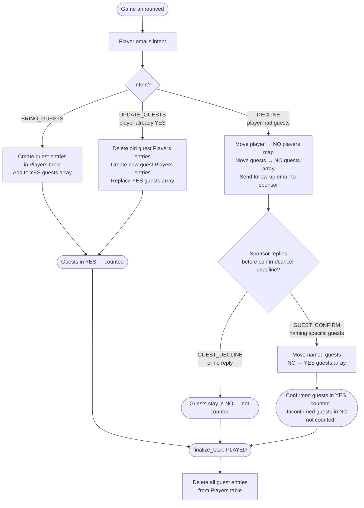

# Basketball Game Scheduler — Architecture

All processing is handled by Lambda functions triggered by EventBridge Scheduler (cron), Step Functions (per-game lifecycle), or S3 events (inbound emails).
Natural language understanding is provided by AWS Bedrock (Claude Haiku) in eu-west-1.

---

## 1. Component Architecture

### How it fits together

| Component | Service | Purpose |
|---|---|---|
| **Weekly cadence** | EventBridge Scheduler | Monday 9AM UTC (`weekly-scheduler`), Tuesday 9PM UTC (`weekly-cutoff-checker`) |
| **Per-game lifecycle** | Step Functions | `basketball-game-lifecycle` state machine — one execution per game, named `game-{gameDate}` |
| **Compute** | Lambda (×8) | `weekly_scheduler`, `weekly_cutoff_checker`, `email_processor`, `admin_processor`, and 4 game-lifecycle task Lambdas (`announce_task`, `reminder_task`, `confirm_or_cancel_task`, `finalize_task`) sharing one deployment package |
| **Email — Outbound** | SES | Sends weekly prompts, tentative announcements, reminders, confirmations/cancellations, and NLU-generated replies |
| **Email — Inbound** | SES Receipt Rule Set | Catches admin and player replies via MX record and stores them in S3 |
| **Raw Email Store** | S3 | Stores the full raw email (headers + body) for each inbound admin/player message |
| **State Store** | DynamoDB | Two tables: `Players` (profiles by email) and `Games` (game status, per-game RSVPs, and weekly counters) — no GSIs needed |
| **NLU Engine** | Bedrock (Claude Haiku) | Parses admin scheduling commands and player intent from free-text emails, drafts contextual replies |
| **DNS** | Route 53 | Hosts the domain and MX record that routes inbound email to SES |

### Key design decisions

- **Admin-driven, multi-game-per-week scheduling** — there is no fixed "every Saturday" game. Each week, the admin decides whether to schedule zero, one, or more games (up to `MAX_GAMES_PER_WEEK`), and on what dates/times.
- **Step Functions per game, not cron-per-stage** — each game gets its own SFN execution carrying `announce_at`/`reminder_at`/`confirm_at`/`finalize_at` timestamps computed relative to its game date. This replaces fixed Mon/Wed/Fri/Sat cron rules for game-stage transitions, since games can now land on any day.
- **No queues (SQS)** — at this scale, Lambda direct invocation (via S3 event notification or SFN task) is sufficient.
- **S3 as the email buffer** — SES stores the raw email in S3, which triggers the processing Lambda via S3 Event Notification. This decouples receiving from processing and gives a natural audit trail.
- **Atomic weekly counters** — `create_game()` uses `TransactWriteItems` with an `if_not_exists()` counter increment, so multiple games scheduled in one admin reply never race on the `weekStatus` item.
- **Single Bedrock call per inbound email** — the prompt includes the email body plus context (current roster, or upcoming dates for admin commands) so Claude can parse intent and draft a reply in one round trip.

---

## 2. Weekly Admin Scheduling Flow

### Step-by-step

1. **Monday 9AM UTC** — EventBridge Scheduler triggers `weekly_scheduler`. It computes next week's Monday (`week_start_for_date(today + 7 days)`) and reads that week's `weekStatus` item.
   - If `gameCount >= MAX_GAMES_PER_WEEK` or the admin already responded, no prompt is sent.
   - Otherwise, every active admin is emailed asking whether to schedule game(s) for that week.
2. **Admin replies** in natural language (e.g. "Tuesday and Saturday", "No games this week") to `admin@<domain>`.
3. `admin_processor` calls Bedrock (`parse_admin_email`), which classifies the intent as `SCHEDULE_GAMES` (one or more `{date, startTime?, durationHours?}` entries, where unmentioned timing is reported as `null`) or `NO_GAMES_THIS_WEEK` (among other admin intents — see §3).
4. **`SCHEDULE_GAMES`**: each game is classified into a policy — neither timing field → default two-tier policy from config; both fields → fixed policy; exactly one field → ambiguous, which **holds the whole batch** (nothing is scheduled) and asks the admin to resend. For each valid game the Lambda calls `create_game(date, policy)` (atomically creates the `gameStatus` carrying the `policy` map + empty `playerStatus#*` items and increments the week's `gameCount`/sets `adminResponded`), then starts a Step Functions execution named `game-{date}` on the `basketball-game-lifecycle` state machine, seeded with `sfn_timestamps_for_game(date)`.
5. **`NO_GAMES_THIS_WEEK`**: marks the week's `weekStatus` with `reason = admin_declined` and emails all active players that there's no game this week. No game record or SFN execution is created.
6. **Tuesday 9PM UTC** — EventBridge Scheduler triggers `weekly_cutoff_checker`. If the admin still hasn't responded for next week (`adminResponded` is falsy), it marks the week `reason = no_response` and emails all active players that there's no game.

### Idempotency

`create_game`'s `TransactWriteItems` sets `adminResponded = true` as part of the same atomic write that creates the game and bumps `gameCount`, so a late cutoff-check run can never overwrite a week the admin already responded to.

---

## 3. Admin Command Flow

Admins interact with the system by emailing `admin@<domain>`. The `admin_processor` Lambda handles all admin commands.

### Admin identity

Admin status is stored as an `isAdmin` flag on a player's record in DynamoDB. This means admins can be added or removed at runtime without redeployment.

### Step-by-step

1. **Admin emails** a natural-language command to `admin@<domain>` (e.g. "Tuesday and Saturday", "Cancel the game on 2026-04-19")
2. **SES Receipt Rule** matches the `admin@` recipient (checked before the catch-all domain rule) and stores the email in S3 under the `admin/` prefix
3. **S3 Event Notification** triggers Lambda `admin_processor` (prefix filter: `admin/`)
4. Lambda checks **`is_admin(sender_email)`** against DynamoDB — returns 403 + rejection email if not an admin
5. Lambda calls **`parse_admin_email`** (Bedrock) to classify the intent
6. Lambda executes the action based on intent:

| Intent | Action |
|---|---|
| `SCHEDULE_GAMES` | Classify each game's policy (default two-tier / fixed / ambiguous); a single ambiguous game holds the whole batch. For each valid game: `create_game(date, policy)` + start SFN execution `game-{date}` (skips if it already exists) |
| `NO_GAMES_THIS_WEEK` | `set_week_no_game(weekStart, "admin_declined")` + broadcast "no game this week" to all active players |
| `CANCEL_GAME` (no existing record) | `pre_cancel_game(date)` — writes a CANCELLED `gameStatus` item directly (advance cancellation, no game was ever scheduled) |
| `CANCEL_GAME` (game is `OPEN`) | `update_game_status(date, "CANCELLED")` + stops the game's SFN execution (`StopExecution`, no-op if already finished) + broadcasts cancellation to YES/MAYBE players and their contactable guests |
| `CANCEL_GAME` (already cancelled/played) | Replies with current status; no action taken |
| `ADD_PLAYER` | `add_player(email, name)` — fails with error email if player already exists |
| `ADD_ADMIN` | `add_player(email, name, is_admin=True)` |
| `DEACTIVATE_PLAYER` | Atomically removes `active=true` record and writes `active=false` record |
| `REACTIVATE_PLAYER` | Reverse of deactivate |
| `UNKNOWN` | Replies with help text listing available commands |

7. Lambda **emails the admin** a confirmation (or error) reply

### SES rule ordering

The admin receipt rule uses `recipients = [admin@<domain>]` and is created first. The catch-all player reply rule uses `recipients = [<domain>]` and is chained after via `after = admin_rule.name`. This ensures admin emails never reach the player email processor.

### SFN start/stop from admin_processor

- `admin_processor` holds `states:StartExecution` on the state machine and `states:StopExecution` scoped to its executions.
- Execution names are deterministic (`game-{gameDate}`), so a duplicate `SCHEDULE_GAMES` for the same date is a safe no-op (`ExecutionAlreadyExists` is caught and ignored).
- `_stop_game_sfn_execution` derives the execution ARN from the state machine ARN and silently ignores `ExecutionDoesNotExist` (the execution may have already finished or never started).

---

## 4. Per-Game Step Functions Lifecycle

Each scheduled game gets its own Step Functions execution (`basketball-game-lifecycle`, started as `game-{gameDate}`), driven by four Wait → Task → Choice stages. Every stage's Task Lambda re-checks `gameStatus` and returns `game_open: false` if the game is no longer `OPEN` (e.g. an admin cancelled it); the following Choice state then routes straight to `Done`, halting the rest of the execution.

```
WaitForAnnouncement (T-7d 9AM UTC)
  -> AnnounceGame -> CheckOpenAfterAnnounce -> [Done | WaitForReminder]
WaitForReminder (T-4d 9AM UTC)
  -> SendReminder -> CheckOpenAfterReminder -> [Done | WaitForConfirmOrCancel]
WaitForConfirmOrCancel (T-2d 9AM UTC)
  -> ConfirmOrCancel -> CheckOpenAfterConfirm -> [Done | WaitForFinalize]
WaitForFinalize (game day 1PM UTC)
  -> FinalizeGame -> Done
```

The four timestamps (`announce_at`, `reminder_at`, `confirm_at`, `finalize_at`) are computed once by `sfn_timestamps_for_game(game_date)` and passed as the execution input by `admin_processor` when the game is created.

### Stage 1 — `announce_task` (T-7 days, 9AM UTC)

If the game is `OPEN`, sends a tentative announcement rendered from the game's `policy` to every active player — two turnout branches (short vs long tier) when the policy is tiered, or a single fixed line when both tiers are equal. Returns `game_open: false` without action if the game is not `OPEN`.

### Stage 2 — `reminder_task` (T-4 days, 9AM UTC)

If the game is `OPEN`, counts confirmed players+guests via `get_roster`. If below the policy's `minPlayers`, emails a low-signup reminder to all pending (not-yet-responded) active players.

### Stage 3 — `confirm_or_cancel_task` (T-2 days, 9AM UTC)

The go/no-go decision point. If confirmed count is below the policy's `minPlayers`:
- Marks the game `CANCELLED`
- Emails everyone who responded (YES/NO/MAYBE) plus all pending players, plus any YES/MAYBE guests with their own contact email

Otherwise:
- Resolves the turnout tier via `resolve_tier(policy, confirmed_count)` (long tier at/above the policy's `threshold`, short tier below) and **freezes** both the start time and duration onto the game record as `confirmedStartTime` / `confirmedDurationHours`, so the time players are told can never be contradicted by later roster changes
- Emails the final confirmation (with the frozen start time, duration, and roster) to all YES players and YES guests with a contact email

### Stage 4 — `finalize_task` (game day, 1PM UTC)

If the game is still `OPEN`, marks it `PLAYED` and deletes all guest entries (from YES/NO/MAYBE rosters) from the Players table. Guest cleanup is best-effort — a failure here is logged and does not prevent the game from being marked `PLAYED`. No-ops if the game is `CANCELLED`/`PLAYED`/missing.

### Cancellation race handling

An admin `CANCEL_GAME` both calls `StopExecution` on the SFN execution **and** sets `gameStatus = CANCELLED` in DynamoDB. The dual guard means that even if `StopExecution` races with an in-flight Wait state resolving, the next Task Lambda's `gameStatus` re-check will still see `CANCELLED` and short-circuit via the Choice state.

---

## 5. Player Reply Processing — NLU Flow

### Step-by-step

1. **Player replies** to an announcement/reminder/confirmation email thread
2. **SES Inbound Rule Set** matches the catch-all `To:` address and stores the raw email in S3
3. **S3 Event Notification** triggers Lambda `email_processor`
4. Lambda checks `get_sender_role(sender_email)`:

   | Role | Criteria | Allowed intents |
   |---|---|---|
   | `player` | `active = "true"` in Players table | All intents |
   | `guest` | `active = "guest#active"` in Players table (has own contact email) | `DECLINE`, `QUERY_ROSTER`, `QUERY_PLAYER` only |
   | `unknown` | Not found (incl. deactivated players) | None — rejection email sent immediately, no Bedrock call |

5. Lambda **resolves which game the reply is about** via `_resolve_game_date` (see §5.1 — needed because multiple games can be open at once)
6. Lambda **fetches the roster** for that game date and **calls Bedrock** (`parse_player_email`) with the email body and roster context
7. **Bedrock returns** a structured response:
   ```json
   {
     "intent": "JOIN | DECLINE | MAYBE | BRING_GUESTS | UPDATE_GUESTS | QUERY_ROSTER | QUERY_PLAYER | GUEST_CONFIRM | GUEST_DECLINE",
     "guests": [{"name": "John", "contact_email": "john@example.com"}],
     "confirmed_guest_names": [],
     "query_target": null,
     "reply_draft": "You're confirmed! So far we have 8 players..."
   }
   ```
8. Lambda **updates DynamoDB** based on the intent (see table below)
9. Lambda **sends the reply** back to the player via SES, with the subject tagged `[Game: {gameDate}]` (see §5.1) and the current roster appended

### 5.1 Multi-game disambiguation

Because the admin can schedule more than one game per week, several games can be `OPEN` simultaneously. `_resolve_game_date` decides which game a reply belongs to, in this order:

1. **Subject marker** — every outbound email's subject is tagged `[Game: YYYY-MM-DD]`. If the player's reply (or its thread) carries that marker:
   - game is `OPEN` → use it directly
   - game is `CANCELLED` → reply with a cancellation notice, stop (no further processing)
   - game is `PLAYED` or missing → fall through to step 2
2. **Single open game** — if exactly one game is `OPEN` system-wide, use it unambiguously (covers players replying without quoting the original subject)
3. **Bedrock `query_target` hint** — if multiple games are open, re-parse the email (without roster context) and check whether `query_target` contains a date matching one of the open games
4. **Ambiguous** — reply asking the player to reply directly to the specific game's announcement email, and take no DynamoDB action

If there are zero open games, the player is told a new game will be announced soon.

### Supported intents

| Player says | Intent | System action |
|---|---|---|
| "I'm in!" / "Count me in" | `JOIN` | Move player to `playerStatus#YES`, reply with current headcount |
| "Can't make it" / "I'm out" | `DECLINE` | Move player to `playerStatus#NO`; if player had guests, move guests to `playerStatus#NO` guests array and send follow-up. If sender is a **guest**, removes them from YES, adds to NO, notifies sponsor |
| "Maybe" / "Not sure yet" | `MAYBE` | Move player to `playerStatus#MAYBE` |
| "I'll bring John and Jane" | `BRING_GUESTS` | Move player to YES; create guest entries in Players table; add guests to `playerStatus#YES` guests array |
| "Change to 3 guests" | `UPDATE_GUESTS` | Delete old guest Players entries and YES guests array entries; create new ones |
| "Who's playing so far?" | `QUERY_ROSTER` | Reply with full roster — no DynamoDB update |
| "Is Sarah coming?" | `QUERY_PLAYER` | Look up player by name/email, reply with their status — no DynamoDB update |
| "John is still coming" *(after cancelling)* | `GUEST_CONFIRM` | Move named guests from `playerStatus#NO` to `playerStatus#YES` guests array |
| "Neither is coming" *(after cancelling)* | `GUEST_DECLINE` | No DynamoDB update — guests stay in `playerStatus#NO`, not counted |

### What if the intent is unclear?

Bedrock will respond conversationally asking for clarification. No DynamoDB update is made — the player simply replies again and the cycle repeats.

### 5.2 Guest Player Flow

Guests are first-class entries — created in the Players table the moment they are declared and tracked through the same YES/NO/MAYBE status items as permanent players.



All guest communication goes through the sponsoring player's email address. Guests never receive emails directly unless they have their own contact email on file.

---

## 6. Data Model

### Two tables, no GSIs

**Table 1: `Players`** — player profiles and per-game guest entries, keyed by email + active status

| Attribute | Key | Type | Description |
|---|---|---|---|
| `email` | **PK** | String | Player's email address, or sponsor's email for nameless guests |
| `active` | **SK** | String | `"true"` for active players; `"false"` for deactivated players; `"guest#active"` or `"guest#active#<name>"` for guests |
| `name` | — | String (nullable) | Display name |
| `isAdmin` | — | Boolean | `true` for admin players; absent or `false` for regular players |
| `sponsorEmail` | — | String | Sponsor's email — guest entries only |
| `gameDate` | — | String | Game the guest was created for — guest entries only |

Guest SK patterns:

| Scenario | PK | SK |
|---|---|---|
| Guest with contact email | `<contactEmail>` | `guest#active` |
| Guest without contact email | `<sponsorEmail>` | `guest#active#<guestName>` |

Guest entries are created on `BRING_GUESTS`/`UPDATE_GUESTS` and deleted by `finalize_task` after `PLAYED`. They are invisible to `get_active_players()` because that query filters on `active = "true"`.

Guests with `sk = "guest#active"` (own contact email as PK) are recognised as `role = "guest"` by `get_sender_role` and can email in to cancel their attendance or query the roster. Nameless guests (`sk = "guest#active#<name>"`, sponsor's email as PK) cannot email in directly.

**Table 2: `Games`** — per-game state/RSVPs and weekly scheduling counters, in a single table

| Attribute | Key | Type | Description |
|---|---|---|---|
| `pk` | **PK** | String | Entity-prefixed partition value: `GAME#<YYYY-MM-DD>` for a game, or `WEEK#<Monday YYYY-MM-DD>` for `weekStatus` items |
| `sk` | **SK** | String | `gameStatus` / `playerStatus#YES` / `playerStatus#NO` / `playerStatus#MAYBE` / `weekStatus` |
| `players` | — | Map | Map of `{email: {name: str}}` — permanent players only, on `playerStatus#*` items |
| `guests` | — | List | Flat list of `{pk, sk, name, sponsorEmail, sponsorName}` objects — on `playerStatus#*` items |
| `status` | — | String | `OPEN` / `CANCELLED` / `PLAYED` — only on `SK = gameStatus` items |
| `createdAt` | — | String | ISO 8601 timestamp — only on `SK = gameStatus` items |
| `policy` | — | Map | The game's timing policy `{minPlayers, threshold, longGame:{startTime,durationHours}, shortGame:{startTime,durationHours}}` — only on `SK = gameStatus` items (a fixed game has equal tiers) |
| `confirmedStartTime` | — | String | Start time frozen at the confirm step — only on `SK = gameStatus` items, set once the game is confirmed |
| `confirmedDurationHours` | — | Number | Duration frozen at the confirm step — only on `SK = gameStatus` items, set once the game is confirmed |
| `gameCount` | — | Number | Number of games scheduled this week — only on `SK = weekStatus` items |
| `adminResponded` | — | Boolean | Whether the admin has responded for this week — only on `SK = weekStatus` items |
| `reason` | — | String | `no_response` / `admin_declined` — only on `SK = weekStatus` items, when no games were scheduled |

**Entity-prefixed partition key.** The `pk` attribute carries a `GAME#`/`WEEK#` token so a key announces its entity type rather than a bare date pretending every row is a game. The prefix is an internal storage detail confined to `common/dynamo.py` (built via `game_pk()`/`week_pk()`, stripped on read by `strip_pk()`); every other layer — handlers, Step Functions input, the `game-{date}` execution name, and email templates — works in bare ISO dates, and read functions still expose a bare `gameDate` field.

`weekStatus` items live on the `WEEK#<Monday>` partition and are additive: `create_game()` atomically increments `gameCount` and sets `adminResponded = true` as part of the same `TransactWriteItems` call that creates the game's `gameStatus` + empty `playerStatus#*` items, so multiple games scheduled in a single admin reply never race on the counter. (The Monday-keyed week row is intentional — its `if_not_exists` upsert must accumulate `gameCount` across multiple games per week.)

### Per-game policy

Each game's timing rules are frozen onto its `gameStatus` record as a `policy` map when the game is created, so the game is self-contained and config changes never retroactively alter a scheduled game. A policy is always two-tier in shape; a **fixed** game is simply one whose `longGame` and `shortGame` tiers are identical (there is no separate flag). At creation, the admin's command classifies the policy:

| Admin gave | Policy |
|---|---|
| neither start time nor duration | **default two-tier** policy seeded from config (`long_game_*` / `short_game_*` / `long_game_threshold` / `min_players`) |
| both start time and duration | **fixed** policy — both tiers equal to the supplied values |
| exactly one of the two | **ambiguous** — rejected; holds the whole batch (nothing is scheduled) and the admin is asked to resend |

`resolve_tier(policy, confirmed_count)` is the single source of truth for the tier rule (long tier at/above `threshold`, short tier below), shared by the announcement and confirm steps.

### Example `playerStatus#YES` item

```json
{
  "pk": "GAME#2026-04-05",
  "sk": "playerStatus#YES",
  "players": {
    "alice@example.com": {"name": "Alice"},
    "bob@example.com": {"name": "Bob"}
  },
  "guests": [
    {"pk": "john@example.com", "sk": "guest#active", "name": "John", "sponsorEmail": "alice@example.com", "sponsorName": "Alice"},
    {"pk": "alice@example.com", "sk": "guest#active#Jane", "name": "Jane", "sponsorEmail": "alice@example.com", "sponsorName": "Alice"}
  ]
}
```

The `guests` array is a flat list across all sponsors. `pk`+`sk` uniquely identify the guest's Players table entry and serve as the cleanup index for `finalize_task`. `sponsorEmail` links each guest back to their sponsor for follow-up filtering.

### Example `gameStatus` item

```json
{
  "pk": "GAME#2026-04-05",
  "sk": "gameStatus",
  "status": "OPEN",
  "createdAt": "2026-03-29T09:00:00+00:00",
  "policy": {
    "minPlayers": 6,
    "threshold": 10,
    "longGame": {"startTime": "10:00 AM", "durationHours": 2},
    "shortGame": {"startTime": "11:00 AM", "durationHours": 1}
  }
}
```

After the confirm step the resolved tier is frozen onto this item as `confirmedStartTime` / `confirmedDurationHours`.

### Example `weekStatus` item

```json
{
  "pk": "WEEK#2026-06-22",
  "sk": "weekStatus",
  "gameCount": 2,
  "adminResponded": true
}
```

### Access patterns

| Query | Table | Operation |
|---|---|---|
| Get all active players | Players | Scan with filter `active = "true"` |
| Get all active admins | Players | Scan with filter `active = "true" AND isAdmin = true` |
| Get game status | Games | GetItem `PK = GAME#<gameDate>, SK = gameStatus` (returns a bare `gameDate` field) |
| Get all currently open games | Games | Scan with filter `sk = gameStatus AND status = OPEN` (each item exposes a bare `gameDate`) |
| Get full roster (all responses) | Games | Query `PK = GAME#<gameDate>, SK begins_with playerStatus#` → returns 3 items |
| Count confirmed (incl. guests) | Games | From roster: `len(YES.players) + len(YES.guests)` |
| Get/set week status | Games | GetItem / UpdateItem `PK = WEEK#<Monday>, SK = weekStatus` |
| Create game + bump week counter | Games | **TransactWriteItems**: 4 `Put`s (gameStatus incl. `policy` + empty YES/NO/MAYBE) + 1 `Update` (`if_not_exists` counter increment on weekStatus) |
| Player changes response (YES → NO) | Games | **TransactWriteItems**: REMOVE from `playerStatus#YES.players.#email` + SET `playerStatus#NO.players.#email` |
| Move guests on player decline | Games | Read YES guests, filter by `sponsorEmail`, write remaining back to YES, append to NO guests array |
| Move confirmed guests (NO → YES) | Games | **TransactWriteItems**: filter NO guests by name+sponsor, write remaining to NO, append matches to YES |
| Get pending players | Both | Get all active players from Players, diff against emails in all `playerStatus#*` players maps |
| Clean up guests after game | Both | Read `guests` arrays from YES/NO/MAYBE; batch delete from Players by `{pk, sk}` |

---

## 7. AWS Services Summary

| Service | Role |
|---|---|
| EventBridge Scheduler | Monday 9AM UTC (weekly prompt) + Tuesday 9PM UTC (cutoff check) |
| Step Functions | One execution per game (`basketball-game-lifecycle`), driving announce → reminder → confirm/cancel → finalize |
| Lambda (×8) | `weekly_scheduler`, `weekly_cutoff_checker`, `email_processor`, `admin_processor`, 4 game-lifecycle task Lambdas |
| SES Outbound | Sends weekly prompts, announcements, reminders, confirmations/cancellations, and replies |
| SES Inbound | Receives admin and player reply emails (ordered receipt rules) |
| S3 | Stores raw inbound emails (prefix-routed: `admin/` → admin, catch-all → players) |
| DynamoDB (×2 tables) | Players + Games (incl. RSVPs and weekly counters) |
| Bedrock (Claude Haiku) | NLU intent parsing for both admin commands and player replies, plus reply generation |
| Route 53 Hosted Zone | DNS for inbound email routing |

---

## 8. Prerequisites Before Building

1. **Register a domain** via Route 53 — required for SES inbound MX records
2. **Exit SES sandbox** — new AWS accounts are sandboxed; submit a support request to enable sending to unverified addresses
3. **Enable Bedrock model access** — the configured Claude Haiku model must be explicitly enabled in the Bedrock console for eu-west-1
4. **Prepare player list** — CSV of emails (names optional) to seed the DynamoDB Players table

---

## 9. Infrastructure as Code

All AWS resources are provisioned via **Terraform**. The configuration creates:

- 8 Lambda functions with IAM roles (`weekly_scheduler`, `weekly_cutoff_checker`, `email_processor`, `admin_processor`, 4 game-lifecycle task functions sharing one deployment package)
- 1 Step Functions state machine (`basketball-game-lifecycle`) with its execution IAM role, plus IAM policies granting `admin_processor` `states:StartExecution`/`states:StopExecution`
- 2 DynamoDB tables (Players + Games)
- 1 S3 bucket with event notification
- SES domain identity, receipt rule set, and receipt rules (admin rule + player reply rule, ordered)
- 2 EventBridge Scheduler schedules (Monday weekly prompt + Tuesday cutoff check)
- Route 53 hosted zone and MX record
- Bedrock model access (manual console step — documented)
