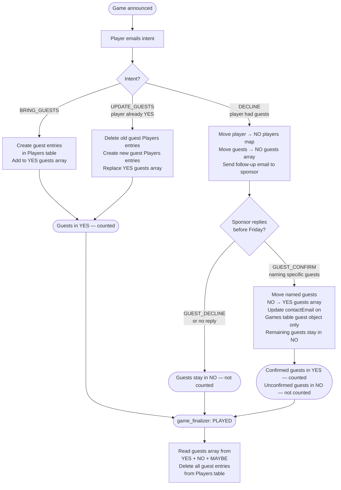

# Guest Player Design

**Date:** 2026-04-04
**Status:** Approved

## Problem

Currently, guests are stored as plain name strings inside the sponsoring player's entry in the Games table (`playerStatus#YES`). When a sponsoring player cancels, their guests are silently dropped — there is no mechanism to keep guests in the game or contact them. Guests are not first-class participants.

## Goals

- Make guests first-class entries in the Players table from the moment they are declared
- Allow guests to remain in the game if their sponsor cancels, by prompting the sponsor to confirm
- Clean up guest entries after the game is finalised
- Keep the name of every player/guest stored in the Games table for easy email generation
- Avoid new status states in the Games table to keep state management simple

---

## Guest State Flow



**Players table** is only written when guests are first created (`BRING_GUESTS`) or replaced (`UPDATE_GUESTS`). Contact emails from follow-up replies are stored on the Games table guest object only — no Players table update needed.

---

## Data Model

### Players Table

No changes to existing permanent player rows (`SK=active`).

Guest entries use a new SK pattern:

| Scenario | PK | SK | Attributes |
|---|---|---|---|
| Guest with contact email | `<contactEmail>` | `guest#active` | `name`, `sponsorEmail`, `gameDate` |
| Guest without contact email | `<sponsorEmail>` | `guest#active#<guestName>` | `name`, `sponsorEmail`, `gameDate` |

- Guest entries are created immediately when a sponsor declares guests (on `BRING_GUESTS` or `UPDATE_GUESTS` intent)
- Guest entries are deleted by `game_finalizer` after the game is marked `PLAYED`

### Games Table

**`playerStatus#<status>` items — updated schema:**

Each `playerStatus#YES`, `playerStatus#NO`, and `playerStatus#MAYBE` item gains a top-level `guests` array alongside the existing `players` map. This means all guests across all sponsors for a given status are stored in one flat list.

```json
{
  "gameDate": "2026-04-05",
  "sk": "playerStatus#YES",
  "players": {
    "alice@example.com": {"name": "Alice"},
    "bob@example.com": {"name": "Bob"}
  },
  "guests": [
    {"pk": "<contactEmail>", "sk": "guest#active", "name": "John", "sponsorEmail": "alice@example.com", "sponsorName": "Alice"},
    {"pk": "alice@example.com", "sk": "guest#active#Jane", "name": "Jane", "sponsorEmail": "alice@example.com", "sponsorName": "Alice"}
  ]
}
```

- `players` map is unchanged — keyed by email, holds player name
- `guests` is a flat array of `{pk, sk, name, sponsorEmail, sponsorName}` objects across all sponsors
  - `pk` and `sk` uniquely identify the guest's Players table entry
  - `sponsorEmail` links each guest back to their sponsor for follow-up and filtering
  - `sponsorName` stored for email generation without extra lookups
- The `guests` array in `playerStatus#YES` is the source of truth for who is attending and serves as the cleanup index for `game_finalizer` — no separate `guestRegistry` item needed

---

## Flow Changes

### `email_processor` — `BRING_GUESTS` intent

1. For each guest name in the reply:
   - If a contact email is provided: create Players entry with `PK=<contactEmail>, SK=guest#active`
   - If no contact email: create Players entry with `PK=<sponsorEmail>, SK=guest#active#<guestName>`
2. Append guest `{pk, sk, name, sponsorEmail, sponsorName}` objects to the `guests` array in `playerStatus#YES`
3. Add the player to `players` map in `playerStatus#YES` with their `name` (if not already present)
4. All writes done in a DynamoDB transaction — if any fail, none are applied

### `email_processor` — `UPDATE_GUESTS` intent

1. Remove existing guest objects for this sponsor from the `guests` array in `playerStatus#YES` (filter by `sponsorEmail`)
2. Delete their corresponding Players table entries using the `{pk, sk}` pairs removed in step 1
3. Create new Players entries for the updated guest list
4. Append new guest objects to the `guests` array in `playerStatus#YES`
5. All writes done in a DynamoDB transaction

### `email_processor` — `DECLINE` intent, player had guests

1. Move player from `playerStatus#YES` `players` map to `playerStatus#NO` `players` map (atomic transact)
2. Move this sponsor's guest objects from `playerStatus#YES` `guests` array to `playerStatus#NO` `guests` array
3. Send follow-up email to sponsor: "You had guests listed — are they still attending? If so, reply with their names and optionally a contact email for each."
4. If no reply by Friday, guests remain in `playerStatus#NO` and are not counted — no further action needed

### `email_processor` — `GUEST_CONFIRM` intent (new)

Triggered when a cancelled sponsor replies naming which guests are still coming:

1. For each confirmed guest, move their object from `playerStatus#NO` `guests` array to `playerStatus#YES` `guests` array
2. If a contact email is provided for a guest, update the `contactEmail` field on their object in the Games table — **no Players table update**
3. Unconfirmed guests remain in `playerStatus#NO` guests array — no action needed
4. All writes done in a DynamoDB transaction

### `email_processor` — `GUEST_DECLINE` intent (new)

Triggered when a cancelled sponsor replies saying no guests are coming:

1. No Games table update needed — guests are already in `playerStatus#NO` and will not be counted
2. No Players table changes — `game_finalizer` handles all guest cleanup

### `reminder_checker`

No changes needed for guest handling. Confirmed player count is:
`len(playerStatus#YES["players"]) + len(playerStatus#YES["guests"])`

Guests in `playerStatus#NO` are automatically excluded from the count.

### `game_finalizer`

1. Read `playerStatus#YES`, `playerStatus#NO`, and `playerStatus#MAYBE` for the game date
2. Collect all `{pk, sk}` pairs from the `guests` array across all three items
3. Delete each guest entry from the Players table
4. Existing game status update to `PLAYED` is unchanged

---

## New Bedrock Intents

| Intent | Trigger | Action |
|---|---|---|
| `GUEST_CONFIRM` | Sponsor replies confirming guests after cancelling | Re-add guests to `playerStatus#YES` guests array, update contact emails |
| `GUEST_DECLINE` | Sponsor replies declining guests after cancelling | Delete guest Players entries |

The system prompt in `bedrock_client.py` must be updated to describe these two new intents.

---

## Error Handling

| Scenario | Handling |
|---|---|
| Guest Players write + `playerStatus#YES` update fails | DynamoDB transaction rolls back atomically; reply with error asking player to retry |
| `game_finalizer` delete fails for a guest entry | Log and continue — guest entry is orphaned but `SK=guest#active` so it won't appear in `get_active_players()` |
| Sponsor does not reply to guest follow-up by Friday | Guests remain in `playerStatus#NO` and are not counted — `game_finalizer` cleans them up after the game |

---

## Testing

### Unit Tests

- `dynamo.py`: create guest entry (with and without contact email), append/remove guests from `playerStatus` guests array, delete guest entries by `{pk, sk}`
- `email_processor`: `BRING_GUESTS` creates Players entries and updates Games table; `DECLINE` with guests removes from YES and sends follow-up; `GUEST_CONFIRM` and `GUEST_DECLINE` intents
- `game_finalizer`: collects guests from all `playerStatus#` items and deletes their Players entries

### Integration Tests

Full end-to-end flows:

**Happy path:**
1. Player announces guests (`BRING_GUESTS`) → guest entries created in Players table, added to `playerStatus#YES` guests array
2. Player cancels (`DECLINE`) → player moves to NO, guests move to `playerStatus#NO` guests array, follow-up email sent
3. Sponsor confirms some guests (`GUEST_CONFIRM`) → confirmed guests moved to `playerStatus#YES` guests array, others remain in NO
4. `game_finalizer` runs → all guest Players entries deleted across YES/NO/MAYBE

**No response path:**
1. Player cancels with guests → guests move to `playerStatus#NO`
2. Sponsor never replies → guests stay in NO, not counted in Friday total
3. `game_finalizer` cleans up guest Players entries

---

## Out of Scope

- Guests receiving emails directly (all communication goes through the sponsoring player's email)
- Guests persisting across games (all guest entries are per-game and cleaned up after `PLAYED`)
- Promoting guests to permanent players (not supported in this design)
