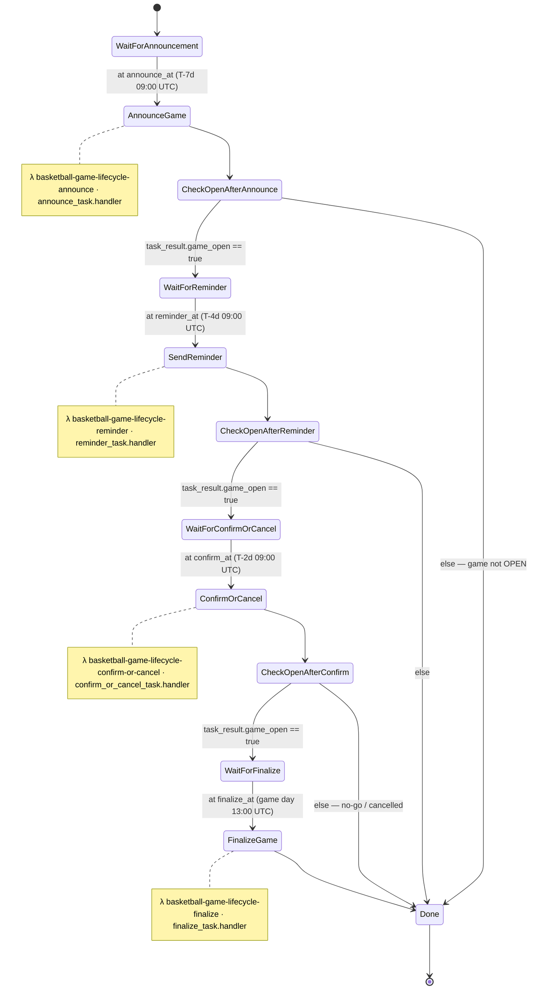

# Game Lifecycle — Step Functions State Transitions

The `basketball-game-lifecycle` state machine runs **one execution per game**, named
`game-{gameDate}`, started by `admin_processor` when an admin schedules a game. It drives
the per-game flow **announce → reminder → confirm/cancel → finalize**, with a `Choice` after
each task that halts the execution early if the game is no longer `OPEN` (e.g. the admin
cancelled it, or `ConfirmOrCancel` decided no-go).

Source of truth: `terraform/step_functions.tf` (definition), `src/game_lifecycle/*.py` (task
returns), `src/common/date_utils.py` (`sfn_timestamps_for_game`).

---

## State diagram



> If your viewer doesn't render Mermaid, see the rendered image:
> [`../../docs/diagrams/game-lifecycle-state-transitions.png`](../../docs/diagrams/game-lifecycle-state-transitions.png)
> (regenerate from `../../docs/diagrams/game-lifecycle-state-transitions.html`).


---

## Tasks → Lambda functions

Each `Task` state invokes one Lambda. All four share a single deployment package
(`game_lifecycle_zip`) and are differentiated by their `handler`. Defined in
`terraform/step_functions.tf` (`Resource`) and `terraform/lambda.tf` (the functions).

| State (Task) | Lambda function | Handler | Source | Fires at |
|---|---|---|---|---|
| `AnnounceGame` | `basketball-game-lifecycle-announce` | `announce_task.handler` | `src/game_lifecycle/announce_task.py` | T−7d 09:00 UTC |
| `SendReminder` | `basketball-game-lifecycle-reminder` | `reminder_task.handler` | `src/game_lifecycle/reminder_task.py` | T−4d 09:00 UTC |
| `ConfirmOrCancel` | `basketball-game-lifecycle-confirm-or-cancel` | `confirm_or_cancel_task.handler` | `src/game_lifecycle/confirm_or_cancel_task.py` | T−2d 09:00 UTC |
| `FinalizeGame` | `basketball-game-lifecycle-finalize` | `finalize_task.handler` | `src/game_lifecycle/finalize_task.py` | game day 13:00 UTC |

The `Wait`, `Choice`, and `Succeed` states are pure Step Functions states — they invoke no
Lambda.

---

## How state flows through transitions

- **`Wait` states** pass their input through unchanged (output == input).
- **`Task` states** send only `Parameters` → `{"game_date": "$.game_date"}` to the Lambda,
  then merge the Lambda's return under **`$.task_result`** (`ResultPath`), leaving the rest of
  the state intact. `task_result` is therefore *overwritten* at each task.
- **`Choice` states** branch on `$.task_result.game_open` and pass state through unchanged.

---

## Execution input

`admin_processor` starts the execution (`name="game-2026-07-07"`) with timestamps computed by
`sfn_timestamps_for_game()`:

```json
{
  "game_date": "2026-07-07",
  "announce_at": "2026-06-30T09:00:00+00:00",
  "reminder_at": "2026-07-03T09:00:00+00:00",
  "confirm_at": "2026-07-05T09:00:00+00:00",
  "finalize_at": "2026-07-07T13:00:00+00:00"
}
```

---

## Happy path — state-by-state output JSON

**1. `WaitForAnnouncement`** (Wait → `$.announce_at`) — output = input (unchanged).

**2. `AnnounceGame`** (Task → `basketball-game-lifecycle-announce`) — Lambda input
`{"game_date":"2026-07-07"}`, returns `{"game_date":"2026-07-07","game_open":true}`. State output:

```json
{
  "game_date": "2026-07-07",
  "announce_at": "2026-06-30T09:00:00+00:00",
  "reminder_at": "2026-07-03T09:00:00+00:00",
  "confirm_at": "2026-07-05T09:00:00+00:00",
  "finalize_at": "2026-07-07T13:00:00+00:00",
  "task_result": { "game_date": "2026-07-07", "game_open": true }
}
```

**3. `CheckOpenAfterAnnounce`** (Choice) — `task_result.game_open == true` → `WaitForReminder`. Output unchanged.

**4. `WaitForReminder`** (Wait → `$.reminder_at`) — passthrough.

**5. `SendReminder`** (Task → `basketball-game-lifecycle-reminder`) — returns `{"game_date":"2026-07-07","game_open":true}`. `task_result` replaced:

```json
{
  "game_date": "2026-07-07",
  "announce_at": "2026-06-30T09:00:00+00:00",
  "reminder_at": "2026-07-03T09:00:00+00:00",
  "confirm_at": "2026-07-05T09:00:00+00:00",
  "finalize_at": "2026-07-07T13:00:00+00:00",
  "task_result": { "game_date": "2026-07-07", "game_open": true }
}
```

**6. `CheckOpenAfterReminder`** (Choice) → `WaitForConfirmOrCancel`.

**7. `WaitForConfirmOrCancel`** (Wait → `$.confirm_at`) — passthrough.

**8. `ConfirmOrCancel`** (Task → `basketball-game-lifecycle-confirm-or-cancel`) — go decision, returns `{"game_date":"2026-07-07","game_open":true}`:

```json
{
  "game_date": "2026-07-07",
  "announce_at": "2026-06-30T09:00:00+00:00",
  "reminder_at": "2026-07-03T09:00:00+00:00",
  "confirm_at": "2026-07-05T09:00:00+00:00",
  "finalize_at": "2026-07-07T13:00:00+00:00",
  "task_result": { "game_date": "2026-07-07", "game_open": true }
}
```

**9. `CheckOpenAfterConfirm`** (Choice) → `WaitForFinalize`.

**10. `WaitForFinalize`** (Wait → `$.finalize_at`) — passthrough.

**11. `FinalizeGame`** (Task → `basketball-game-lifecycle-finalize`) — returns
`{"game_date":"2026-07-07","action":"marked_played","guests_deleted":2}`. **Final execution output:**

```json
{
  "game_date": "2026-07-07",
  "announce_at": "2026-06-30T09:00:00+00:00",
  "reminder_at": "2026-07-03T09:00:00+00:00",
  "confirm_at": "2026-07-05T09:00:00+00:00",
  "finalize_at": "2026-07-07T13:00:00+00:00",
  "task_result": {
    "game_date": "2026-07-07",
    "action": "marked_played",
    "guests_deleted": 2
  }
}
```

**12. `Done`** (Succeed) — emits that object as the execution result.

---

## Early-exit branch (game no longer OPEN)

Any task can short-circuit by returning `game_open: false` (e.g. admin cancelled, or
`ConfirmOrCancel` no-go on min players). The next `Choice` hits its `Default → Done`, skipping
the remaining `Wait`/`Task` states; the execution still **succeeds** with that state as output.
Example after `ConfirmOrCancel` cancels:

```json
{
  "game_date": "2026-07-07",
  "announce_at": "2026-06-30T09:00:00+00:00",
  "reminder_at": "2026-07-03T09:00:00+00:00",
  "confirm_at": "2026-07-05T09:00:00+00:00",
  "finalize_at": "2026-07-07T13:00:00+00:00",
  "task_result": { "game_date": "2026-07-07", "game_open": false }
}
```

---

## Task-return variants seen in `task_result`

```json
{ "game_date": "2026-07-07", "game_open": true }                                    // announce / reminder / confirm: still OPEN → continue
{ "game_date": "2026-07-07", "game_open": false }                                   // announce / reminder / confirm: not OPEN → halts at next Choice
{ "game_date": "2026-07-07", "action": "marked_played", "guests_deleted": 2 }       // finalize: played, deleted 2 guest rows
{ "game_date": "2026-07-07", "action": "marked_played", "guests_deleted": 0 }       // finalize: played, no guest rows to delete
{ "game_date": "2026-07-07", "action": "no_op" }                                    // finalize: game wasn't in a playable state
```
